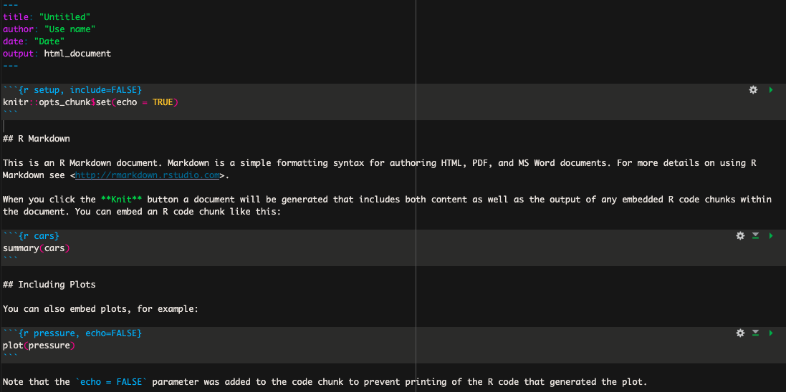

# R Markdown

Plusieurs préfèrent rédiger leurs scripts dans des fichiers de type R Markdown plutôt que R Script pour diverses raions. Je recommande personnellement d'utiliser R Markdown pour les raisons suivantes : 

- Ce type de fichier permet de facilement annoter son script entre les sections de codes qui sont comprises dans un bloc ("chunk" en anglais).

  - Un script bien annoter permet non seulement au scripteur de s'y retrouver facilement mais aussi de partager son code à ses collègues ou même publiquement. 
  
  - En effet, il est de plus en plus commun de retrouver dans les articles scientifiques un lien vers les scripts générés et uilisés par les auteurs de l'article afin d'analyser leurs données. 

- Mais aussi, les blocs de codes permettent d'exécuter seulement certaines sections de code à la fois, ce qui ultimement permet de mofidier puis exécuter seulement ces sections de code sans avoir à re-exécuter l'entièreté du script. 

## Utliser R Markdowm

La première étape consiste donc à créer un nouveau document de type R Mardown. Pour cela, ouvrez RStudio, puis cliquez sur `Fichier`. Dans le menu déroulant sélectionner `Nouveau Fichier` puis `R Markdown...`. 

Dans la nouvelle fenêtre vous pouvez donner le titre que vous voulez à votre nouveau document. 
Par défault le nouveau document affiche une petite introduction ainsi que des exemples tel que sur l'image ci-dessous : 

```{r echo=FALSE, out.width = "100%", fig.align = "center", out.lenght = "100%"}

```

Ces informations ne sont pas pertinentes et vous pouvez supprimer l'ensemble du texte sous l'entête (l'entête correspond à la section délimitée par les trois tirets `---`).

### Bloc de codes 

Dans R markdown, les lignes de codes à exécuter doivent être comprises dans un bloc de code. Le texte non compris dans un bloc n'est donc pas considéré comme du code, ce qui permet d'annoter minutieusement votre script entre les blocs afin de vous y retrouver facilement. 

Un bloc de code R doit toujours débuter avec les caractères suivants : ` ```{r}` 
et se terminer avec les caractères suivant : ` ``` `. Un bloc de code ressemble donc à ceci : 

````{verbatim, lang = "python"}
```{r}

``` 
```` 

Un bloc de code peut être inséré avec l'une des façons suivantes : 

- le raccourcit clavier : `Ctrl` + `Alt` + `I` 
- tapper manuellement les caractères délimitants (` ```{r} `  ` ``` ` )
- l'onglet `Code` puis `Insert chunk` 
- le bouton vert avec le petit c et signe de plus en haut à droite.

Un fois votre code rédigé dans le bloc, vous pouvez exécuter l'entièreté du code contenu dans ce block en appuyant sur le bouton vert en haut à droite du code (<font color='green'> ▶ </font>). 

Il est possible d'insérer des blocs de code de différents languages de programmation tels que Bash et Python, il suffit de remplacer le `r` entre les accolades par le nom du programme utilisé. 

Plusieurs autres options peuvent être appliqués sur les blocs, pour plus d'informations je vous recommande de consulter la documentation disponible sur internet. 
